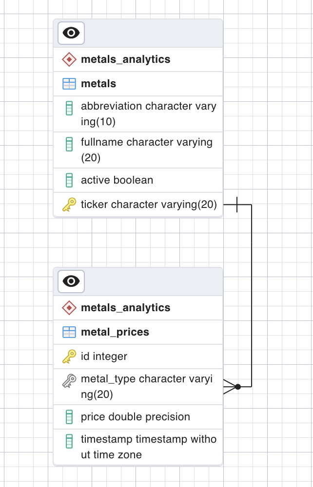

# Metal Prices Airflow Project

## Project Overview

This project utilizes Apache Airflow to automate the process of pulling metals prices data, storing raw data in S3 bucket, ingesting it into (local) PostgreSQL database, triggering model training, and implementing a backup workflow. All tasks are scheduled using Airflow DAGs.

## Setup

### Prerequisites
1. create respecitve .env files from .env.example.
    - `db/.env.example` holds variables needed for creating local Postgres DB and schema+tables creation
    - `docker/airflow/plugins/scripts/.env.example` holds variables that will be inserted as Airflow Variables and used to create Airlow Connections.

2. Local postgresql running

## Project Structure

- `start.sh`: script creating relevant schema objects, starting a complete local instance of Airflow and running config scripts.
- **sql/** - sql queries meant to create necessary objects and seed basic data
    - `12h_metal_prices_view.sql` - creates a view for model training (last 12h of Metal Data)
    - `seed.sql` - inserts metals which prices will be pulled from the API
- **db/**: 
    - `create_db.py` - creates schema, table for persistent API data storage and view on last 12h data meant for model training.
    - `utils.py` - connectors for DB
- **docker/**: folder containing contenerized applications, in this case its the default Airflow compose set up.
    - `docker-compose.yaml` - default Airflow compose set up
    - `Dockerfile` - lightly customized Airflow image to intall necessary python packages.
    - **airflow/dags** - airflow setup
        - `initializer.py` - DAG starting the metal-api data ingestion. Checks for existence of relevant buckets and creates them if none is present. Then triggers `get_prices.py` DAG. Runs every hour.
        - `get_prices.py` - if triggered, calls the Metal Data API for metals of interest pulled from Postgres (silver, gold, platinum and palladium). Dumps the raw data in S3 as JSON, then transforms it into tabular data and ingest into local PostgreSQL, deletes ingested entry from S3 and triggers training.
        - `train_model.py` - one-tasked DAG that pulls data from PostgreSQL view of 12h data, trains and saves models in a gzip file in S3 bucket.
        - `backup.py` - periodical (6h) backup of entire ingested Metal Data and models from S3 bucket. Backups are saved locally, which could be improved to some more appropriate destination. Keeps only 20 backups locally.
    - **airflow/plugins**
        - `customHooks/parametrizedHttp.py` - custom hook to allow sending params
        - `ml/model.py` - adjusted model file with training and saving options. `train()` expects DataFrame data from PostgreSQL 12h-view. `save()` saves zipped models locally, ingests them into S3 bucket and deletes the local copy afterwards.
        - `utils/error_decorator.py` - generic error to wrap around Taskflow-defined task and catch any possible error to interrupt Airflow workflow from proceeding.
        - `scripts/add_global_vars.py` - script executed after spinning up containers to set up all necessary Variables and Connections for Airflow.

## Database structure
0. Dedicated schema (`metals_analytics`)
1. Table holding metals of interest, metals which prices will be pulled from the API, their full naming and abbreviation (`metals`)
2. Table holding data ingested from S3 bucket for API-pulled metal data (`metal_prices`)
3. View for showing data from table 2. from the interval of last 12h (`metals_training_data`)

